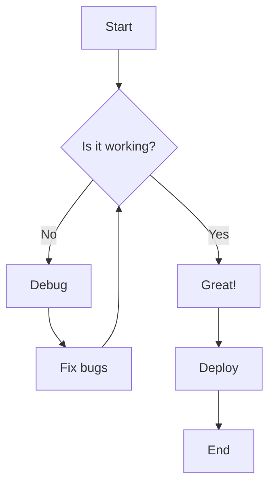
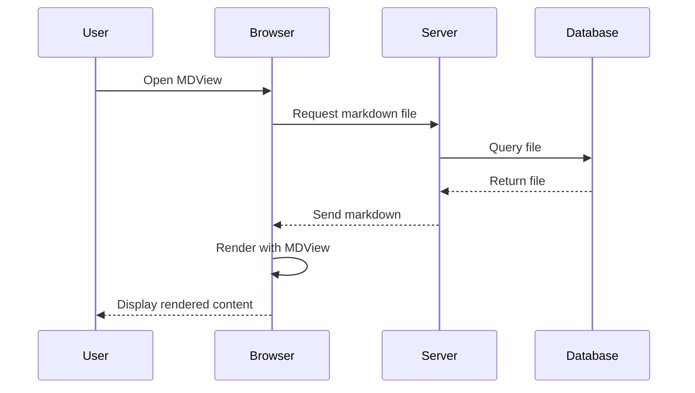
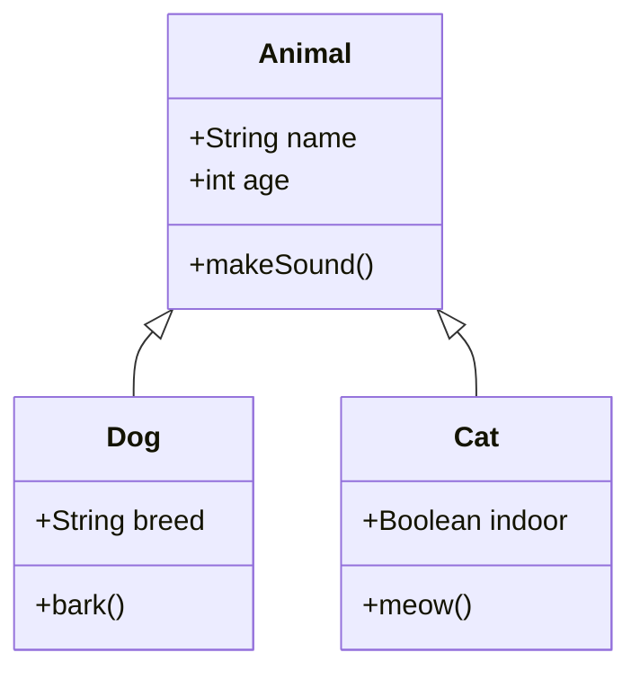
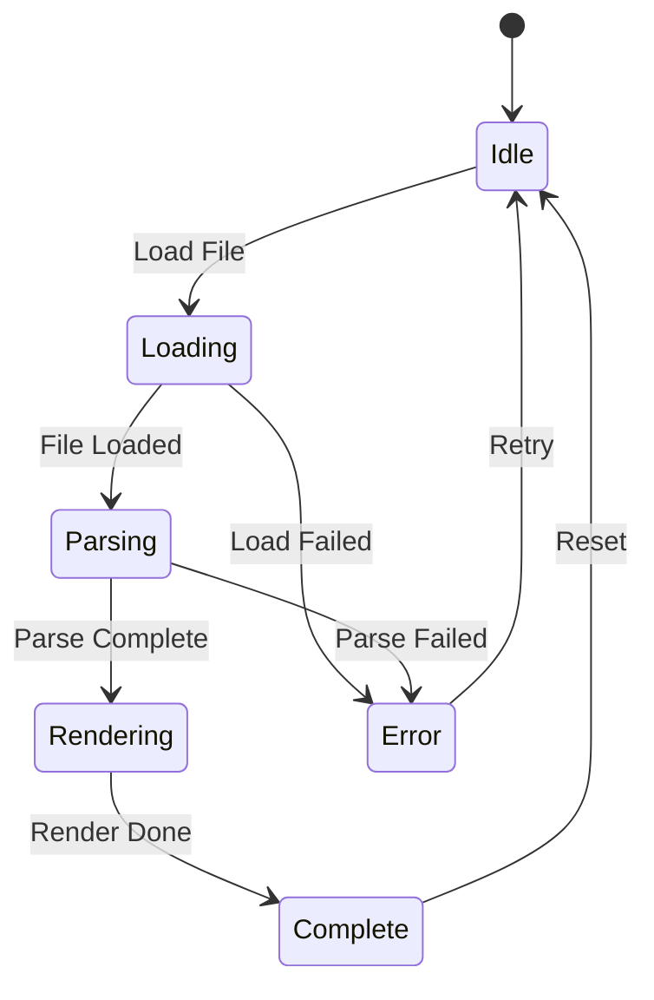
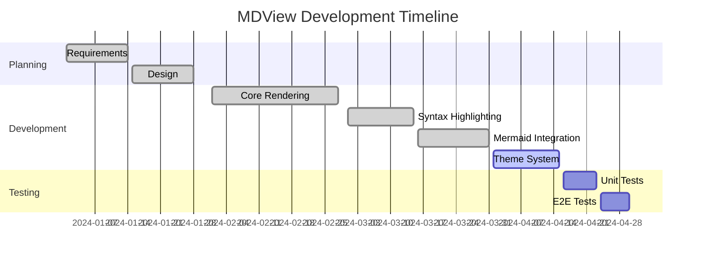
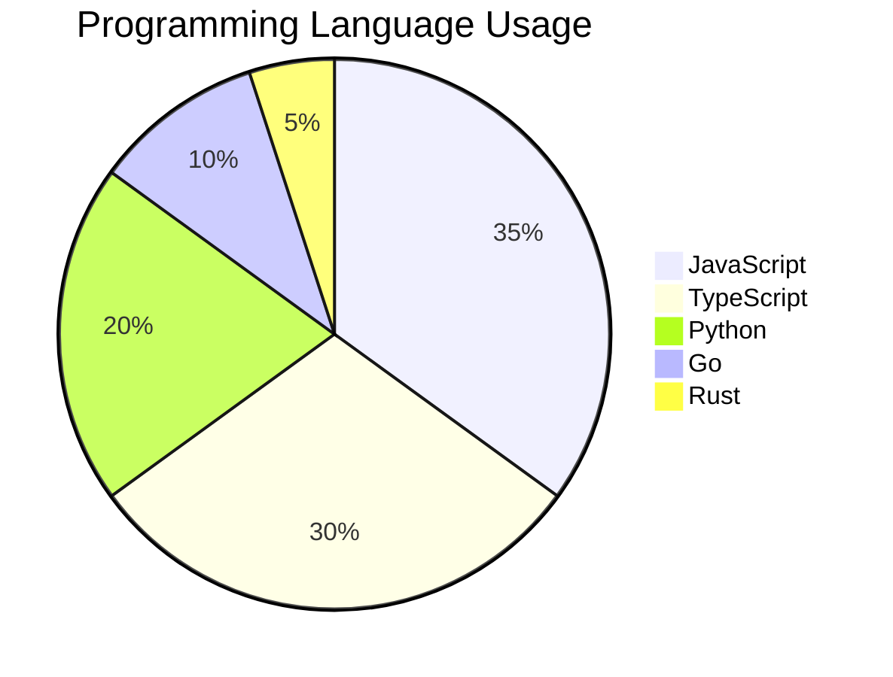
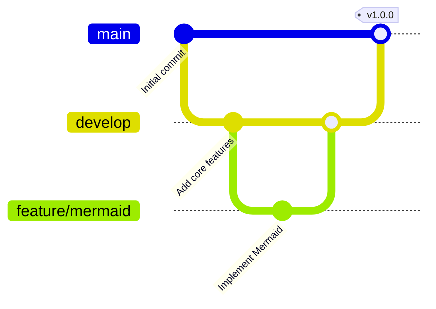
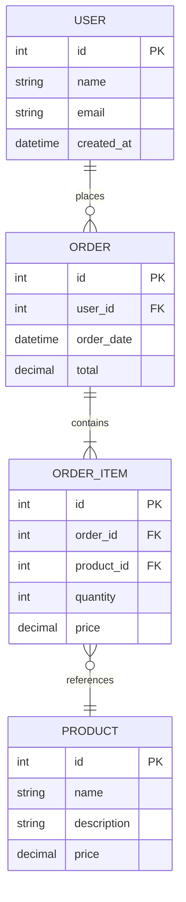

# MDView Feature Showcase

Welcome to the MDView feature showcase! This document demonstrates all the rendering capabilities of MDView, from basic Markdown to advanced features like Mermaid diagrams and syntax highlighting.

## Table of Contents

1. [Text Formatting](#text-formatting)
2. [Lists](#lists)
3. [Code Blocks](#code-blocks)
4. [Tables](#tables)
5. [Links and Images](#links-and-images)
6. [Blockquotes](#blockquotes)
7. [Mermaid Diagrams](#mermaid-diagrams)
8. [Advanced Features](#advanced-features)

---

## Text Formatting

### Basic Formatting

You can make text **bold**, *italic*, or ***bold and italic***. You can also use ~~strikethrough~~ text.

Inline `code` is great for highlighting function names or commands like `npm install`.

### Headings

MDView supports all six heading levels with automatic anchor links:

# Heading 1
## Heading 2
### Heading 3
#### Heading 4
##### Heading 5
###### Heading 6

### Emoji Support

MDView supports emoji shortcodes! :rocket: :sparkles: :heart: :fire: :tada: :computer: :books: :bulb:

---

## Lists

### Unordered Lists

- First item
- Second item
  - Nested item
  - Another nested item
    - Deep nesting
- Third item

### Ordered Lists

1. First step
2. Second step
   1. Sub-step A
   2. Sub-step B
3. Third step

### Task Lists

MDView supports GitHub-style task lists:

- [x] Implement core rendering
- [x] Add syntax highlighting
- [x] Support Mermaid diagrams
- [ ] Add more themes
- [ ] Implement export features

---

## Code Blocks

### JavaScript

```javascript
// Modern JavaScript with async/await
async function fetchUserData(userId) {
  try {
    const response = await fetch(`/api/users/${userId}`);
    const data = await response.json();
    return data;
  } catch (error) {
    console.error('Error fetching user:', error);
    throw error;
  }
}

// Arrow functions and destructuring
const processUsers = users => users
  .filter(({ active }) => active)
  .map(({ id, name, email }) => ({ id, name, email }));
```

### TypeScript

```typescript
// TypeScript interfaces and generics
interface User {
  id: number;
  name: string;
  email: string;
  roles: Role[];
}

type Role = 'admin' | 'user' | 'guest';

class UserService<T extends User> {
  private users: Map<number, T> = new Map();

  add(user: T): void {
    this.users.set(user.id, user);
  }

  get(id: number): T | undefined {
    return this.users.get(id);
  }

  findByRole(role: Role): T[] {
    return Array.from(this.users.values())
      .filter(user => user.roles.includes(role));
  }
}
```

### Python

```python
# Python with decorators and type hints
from typing import List, Optional
from dataclasses import dataclass
from functools import lru_cache

@dataclass
class Point:
    x: float
    y: float
    
    def distance_from_origin(self) -> float:
        return (self.x ** 2 + self.y ** 2) ** 0.5

@lru_cache(maxsize=128)
def fibonacci(n: int) -> int:
    """Calculate Fibonacci number with memoization."""
    if n < 2:
        return n
    return fibonacci(n - 1) + fibonacci(n - 2)

def process_points(points: List[Point]) -> Optional[Point]:
    """Find the point furthest from origin."""
    if not points:
        return None
    return max(points, key=lambda p: p.distance_from_origin())
```

### Rust

```rust
// Rust with ownership and pattern matching
use std::collections::HashMap;

#[derive(Debug, Clone)]
struct User {
    id: u64,
    name: String,
    email: String,
}

impl User {
    fn new(id: u64, name: &str, email: &str) -> Self {
        User {
            id,
            name: name.to_string(),
            email: email.to_string(),
        }
    }
}

fn find_user(users: &HashMap<u64, User>, id: u64) -> Option<&User> {
    users.get(&id)
}

fn main() {
    let mut users = HashMap::new();
    users.insert(1, User::new(1, "Alice", "alice@example.com"));
    
    match find_user(&users, 1) {
        Some(user) => println!("Found: {:?}", user),
        None => println!("User not found"),
    }
}
```

### Go

```go
// Go with goroutines and channels
package main

import (
    "fmt"
    "sync"
    "time"
)

type Result struct {
    ID    int
    Value string
    Error error
}

func worker(id int, jobs <-chan int, results chan<- Result, wg *sync.WaitGroup) {
    defer wg.Done()
    
    for job := range jobs {
        time.Sleep(time.Second)
        results <- Result{
            ID:    id,
            Value: fmt.Sprintf("Processed job %d", job),
            Error: nil,
        }
    }
}

func main() {
    jobs := make(chan int, 10)
    results := make(chan Result, 10)
    var wg sync.WaitGroup
    
    // Start workers
    for w := 1; w <= 3; w++ {
        wg.Add(1)
        go worker(w, jobs, results, &wg)
    }
    
    // Send jobs
    for j := 1; j <= 5; j++ {
        jobs <- j
    }
    close(jobs)
    
    wg.Wait()
    close(results)
}
```

### SQL

```sql
-- Complex SQL query with CTEs and joins
WITH monthly_sales AS (
  SELECT 
    DATE_TRUNC('month', order_date) AS month,
    product_id,
    SUM(quantity * unit_price) AS total_sales
  FROM orders
  WHERE order_date >= '2024-01-01'
  GROUP BY 1, 2
),
ranked_products AS (
  SELECT 
    month,
    product_id,
    total_sales,
    RANK() OVER (PARTITION BY month ORDER BY total_sales DESC) AS rank
  FROM monthly_sales
)
SELECT 
  rp.month,
  p.name AS product_name,
  rp.total_sales,
  rp.rank
FROM ranked_products rp
JOIN products p ON rp.product_id = p.id
WHERE rp.rank <= 10
ORDER BY rp.month DESC, rp.rank;
```

---

## Tables

### Basic Table

| Feature | Status | Priority |
|---------|--------|----------|
| Syntax Highlighting | Complete | High |
| Mermaid Diagrams | Complete | High |
| Theme Support | Complete | Medium |
| Export to PDF | Planned | Low |

### Table with Alignment

| Left Aligned | Center Aligned | Right Aligned |
|:-------------|:--------------:|--------------:|
| Text | Text | Text |
| More text | More text | More text |
| Even more | Even more | Even more |

---

## Links and Images

### Links

- External link: [MDView on GitHub](https://github.com/jamesainslie/mdview)
- Internal link: [Back to Text Formatting](#text-formatting)
- Link with title: [Markdown Guide](https://www.markdownguide.org "Learn Markdown")

### Reference Links

MDView supports [reference-style links][1] which are useful for [longer documents][2].

[1]: https://example.com
[2]: https://example.org

---

## Blockquotes

### Simple Blockquote

> This is a blockquote. It can span multiple lines and is useful for highlighting important information or quotes from other sources.

### Nested Blockquotes

> This is the first level of quoting.
>
> > This is a nested blockquote.
> >
> > > You can nest them multiple levels deep.

### Blockquote with Other Elements

> ### Quoted Heading
> 
> - Quoted list item
> - Another item
>
> ```javascript
> // Even code in quotes!
> console.log('Hello from a blockquote');
> ```

---

## Mermaid Diagrams

MDView supports interactive Mermaid diagrams with zoom, pan, and export capabilities!

### Flowchart



### Sequence Diagram



### Class Diagram



### State Diagram



### Gantt Chart



### Pie Chart



### Git Graph



### Entity Relationship Diagram



---

## Advanced Features

### Footnotes

Here's a sentence with a footnote[^1]. And here's another one[^2].

[^1]: This is the first footnote. MDView renders these at the bottom of the document with automatic numbering and back-references.

[^2]: This is the second footnote. You can include **formatting** and even `code` in footnotes!

### Automatic Heading Anchors

All headings automatically get anchor links, making it easy to navigate and share specific sections of your document. Try clicking the headings in the table of contents!

### Copy Code Blocks

Hover over any code block to see the copy button in the top-right corner. One click copies the entire code block to your clipboard.

### Horizontal Rules

You can create horizontal rules using three or more hyphens, asterisks, or underscores:

---

***

___

### HTML Entities

MDView safely handles HTML entities: &copy; &trade; &reg; &mdash; &ndash; &hellip;

### Definition Lists

Term 1
:   Definition 1

Term 2
:   Definition 2a
:   Definition 2b

---

## Performance Features

MDView is optimized for large documents:

- **Progressive Hydration**: Instant skeleton rendering followed by progressive content loading
- **Lazy Loading**: Images and diagrams load as you scroll
- **Web Workers**: Heavy processing happens off the main thread
- **Efficient Re-rendering**: Only changed sections are re-rendered
- **Smart Caching**: Three-tier caching system for optimal performance

---

## Theme System

MDView includes 8 beautiful themes:

1. **GitHub Light** - Clean and familiar light theme
2. **GitHub Dark** - Popular dark theme for GitHub users
3. **Catppuccin Latte** - Warm light theme with pastel colors
4. **Catppuccin Frappé** - Cool mid-tone theme
5. **Catppuccin Macchiato** - Balanced dark theme
6. **Catppuccin Mocha** - Deep dark theme
7. **Monokai** - Classic programmer's theme
8. **Monokai Pro** - Modern take on Monokai

Enable **Auto Dark Mode** to automatically switch themes based on your system preference!

---

## Keyboard Shortcuts

### Diagram Controls

- `+` / `=` - Zoom in
- `-` - Zoom out
- `0` - Reset zoom
- `f` - Fit diagram to view
- `m` - Maximize diagram
- `e` - Export diagram as SVG
- `Esc` - Close maximized diagram
- `Shift + Arrows` - Pan diagram

---

## Security

MDView prioritizes security:

- All content is sanitized with DOMPurify
- No external network calls
- Strict Content Security Policy
- Safe Mermaid rendering
- Minimal permissions required

---

## Open Source

MDView is open source and MIT licensed. Contributions are welcome!

**Repository**: [github.com/jamesainslie/mdview](https://github.com/jamesainslie/mdview)

**Technologies**:
- TypeScript 5.3+
- Vite 5.x
- markdown-it v14
- Highlight.js v11
- Mermaid.js v10
- DOMPurify v3

---

**Thank you for using MDView!** :heart:

*This document was created to showcase the full feature set of MDView. Open it in Chrome with the MDView extension to see all these features in action.*

