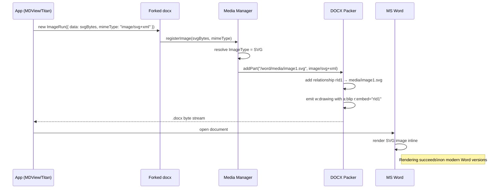

## RFC-20251202-001: SVG Support in Forked `docx` Library for MDView and Titan

> Status: Draft  
> Author: James Ainslie  
> Created: 2025-12-02  

### Abstract

This RFC proposes forking the `dolanmiu/docx` library to add first-class SVG image support for DOCX documents.  
The fork will enable embedding Mermaid-generated diagrams as SVG images without rasterization, while preserving full backward compatibility for existing PNG/JPEG users. The change will be packaged as a new library artifact (or namespace) and integrated into MDView (for browser-based exports) and Titan (and other consumers) as an optional upgrade path.

---

### Table of Contents

- [Abstract](#abstract)  
- [Motivation](#motivation)  
  - [Problem Statement](#problem-statement)  
  - [Success Criteria](#success-criteria)  
- [Proposal](#proposal)  
  - [Goals](#goals)  
  - [Non-Goals](#non-goals)  
- [Design](#design)  
  - [Architecture](#architecture)  
  - [Data Flow](#data-flow)  
  - [Configuration](#configuration)  
  - [API/Interface](#apiinterface)  
- [Implementation](#implementation)  
  - [Phase 1: Foundation](#phase-1-foundation)  
  - [Phase 2: Integration](#phase-2-integration)  
  - [Phase 3: Production](#phase-3-production)  
- [Testing Strategy](#testing-strategy)  
  - [Unit Tests](#unit-tests)  
  - [Integration Tests](#integration-tests)  
  - [Performance Tests](#performance-tests)  
- [Security Considerations](#security-considerations)  
- [Operational Considerations](#operational-considerations)  
  - [Monitoring](#monitoring)  
  - [Logging](#logging)  
  - [Alerting](#alerting)  
- [Migration Path](#migration-path)  
  - [For Existing Systems](#for-existing-systems)  
  - [Backward Compatibility](#backward-compatibility)  
- [Alternatives Considered](#alternatives-considered)  
- [Open Questions](#open-questions)  
- [References](#references)  

---

## Motivation

### Problem Statement

Current MDView and Titan DOCX export flows rely on the `docx` (dolanmiu/docx) library, which only supports raster image formats (PNG, JPEG, GIF, etc.). This limitation forces all vector content, including Mermaid diagrams, to be converted to PNG prior to embedding in DOCX. In browser-constrained environments (such as the MDView Chrome extension), this rasterization is both technically fragile (canvas taint rules, WASM loading constraints) and lossy (loss of scalability and sharpness).

Specific issues:

- **Lack of SVG support in `docx`**:
  - The library does not provide any public or internal mechanism to embed SVG (`image/svg+xml`) image parts into the DOCX package.
  - All image handling is built around format sniffing for raster headers and emitting `.png` / `.jpeg` parts only.

- **Browser-based exporters are constrained**:
  - Chrome extensions cannot invoke local CLIs (such as `@mermaid-js/mermaid-cli`) or arbitrary Node processes.
  - Browser-based rasterization (canvas or WASM engines) introduces complexity, performance overhead, and additional failure modes.

- **Quality and maintainability concerns**:
  - Vector diagrams lose their scalability and clarity when rasterized at a fixed resolution.
  - Maintaining and debugging a separate rasterization pipeline is an ongoing cost, especially when upstream `docx` would be a more natural place to represent image formats.

From a business and developer-experience perspective, there is demand for:

- High-quality, zoomable diagrams in DOCX outputs (for design documents, RFCs, and operator runbooks).
- A reliable, reusable, and library-level solution that multiple tools can consume, rather than custom one-off rasterization in each consumer.

### Success Criteria

The fork is considered successful if:

- **Functional**:
  - The forked library can generate DOCX files containing SVG images that render correctly in Microsoft Word 2019+ and Microsoft 365 on both Windows and macOS.
  - Existing PNG/JPEG usages in MDView, Titan, and other consumers behave identically to pre-fork behaviour.

- **API stability**:
  - Existing `ImageRun`-based call sites continue to compile and run without modification.
  - New API for SVG is additive, minimal, and type-safe.

- **Compatibility and robustness**:
  - Generated DOCX packages are valid OOXML, pass basic validators (where available), and can be opened and edited in Word without warnings.
  - The library supports a mix of SVG and raster images in the same document.

- **Adoptability**:
  - MDView and Titan can switch from a rasterization pipeline to direct SVG embedding with only local code changes (no fork-specific hacks beyond using the new API).

---

## Proposal

### Goals

- **Goal 1**: Extend the `docx` media subsystem to support SVG as a first-class image type (with `.svg` parts and `image/svg+xml` content type).
- **Goal 2**: Provide a minimal, backwards-compatible public API for constructing SVG-backed `ImageRun` instances.
- **Goal 3**: Validate the approach through end-to-end tests and real-world integration (MDView exports with Mermaid diagrams, and at least one Titan document workflow).
- **Goal 4**: Package and publish the fork under a clear namespace (for example `@yaklab/docx`), with documentation that explicitly calls out SVG support and Word version requirements.

### Non-Goals

- **Non-goal 1**: Guarantee that SVG images render in all DOCX readers and legacy Word versions. The target is modern Word; other behaviour is best-effort.
- **Non-goal 2**: Implement automatic raster fallbacks (PNG) for SVG images in this initial iteration. A fallback path may be considered in follow-up work.
- **Non-goal 3**: Broaden the fork to encompass unrelated enhancements or breaking changes to the `docx` API.

---

## Design

### Architecture

At a high level, the fork introduces SVG handling into the existing `docx` media pipeline, while leaving the rest of the library (document model, numbering, paragraphs, etc.) unchanged.

```mermaid
graph TB
    A[User Code\n(MDView, Titan, etc.)] --> B[ImageRun API\n(new SVG options)]
    B --> C[Media Abstraction\n(ImageType, content types)]
    C --> D[DOCX Package Builder\n(Packer, Parts, Rels)]
    D --> E[DOCX File\nwith /word/media/imageN.svg]

    subgraph Existing Path
      B --> C
      C --> D
      D --> F[DOCX File\nwith PNG/JPEG images]
    end

    style B fill:#e2f0ff,stroke:#2962ff,stroke-width:1px
    style C fill:#f9f9f9,stroke:#999,stroke-width:1px
    style D fill:#f9f9f9,stroke:#999,stroke-width:1px
    style E fill:#e8ffe8,stroke:#2e7d32,stroke-width:1px
    style F fill:#ffffff,stroke:#bbb,stroke-width:1px
```

Key architectural elements:

- **ImageType extension**: Add `SVG` to the internal representation of image formats.
- **Content type and extension mapping**:
  - Map `ImageType.SVG` → extension `.svg`, content type `image/svg+xml`.
- **ImageRun enhancement**:
  - Extend options to accept `mimeType` or `format`, allowing callers to explicitly specify `'image/svg+xml'` or `'svg'`.
  - Provide a helper `ImageRun.fromSvg(...)` that constructs a correctly configured instance.
- **Packer integration**:
  - When encountering an `ImageRun` whose image type resolves to `SVG`, emit `/word/media/imageN.svg` and associated content-type override.
  - Use standard image relationships and `<a:blip>` references for SVG parts.

### Data Flow

The data path for an SVG image is:



Summary:

1. Application constructs `ImageRun` with SVG data and hints the MIME type.
2. The media manager resolves this to `ImageType.SVG` and writes an SVG part.
3. The packer wires the part and relationships into the DOCX container.
4. Word loads the package and renders the SVG.

### Configuration

Configuration is minimal and local to the consumers:

- **Library selection**:
  - Consumers that need SVG support depend on the forked package (for example `@yaklab/docx`) instead of `docx`.
- **Per-usage options**:

```ts
import { ImageRun } from '@yaklab/docx';

const image = new ImageRun({
  data: svgBytes,                 // Uint8Array or ArrayBuffer
  mimeType: 'image/svg+xml',
  transformation: {
    width: 600,
    height: 300,
  },
});
```

- **Optional helper**:

```ts
const image = ImageRun.fromSvg(svgString, {
  width: 600,
  height: 300,
});
```

No global configuration flags are required for SVG support.

### API/Interface

#### Public API additions

- **Extended `ImageRun` options** (TypeScript):

```ts
interface ImageRunOptions {
  data: Uint8Array | ArrayBuffer;
  transformation?: {
    width: number;
    height: number;
  };
  mimeType?: string;                      // for example "image/svg+xml"
  format?: 'png' | 'jpeg' | 'gif' | 'svg'; // optional, alternative to mimeType
}
```

- **New helper**:

```ts
class ImageRun {
  constructor(options: ImageRunOptions);

  static fromSvg(
    svg: string | Uint8Array | ArrayBuffer,
    options: { width: number; height: number }
  ): ImageRun;
}
```

#### Behaviour

- If `mimeType` or `format` indicates SVG, the library:
  - Treats `data` as an opaque SVG payload.
  - Stores it under `/word/media/imageN.svg`.
  - Registers `image/svg+xml` in `[Content_Types].xml`.
- If `mimeType`/`format` is absent, behaviour is identical to upstream `docx`.

---

## Implementation

### Phase 1: Foundation

Initial fork and internal support for SVG.

- **Steps**:
  - Fork `dolanmiu/docx` into a new repository (for example `yaklab/docx-svg`).
  - Introduce `ImageType.SVG` and update:
    - Image extension mapping: `SVG → .svg`.
    - Image content type mapping: `SVG → image/svg+xml`.
  - Extend image type resolution logic:
    - Honour `mimeType`/`format` when provided.
    - Fallback to existing magic-byte detection for PNG/JPEG/GIF.
  - Update media/packer code to:
    - Write SVG parts and relationships.
    - Add correct `<Override>` entries to `[Content_Types].xml`.
  - Add unit tests for:
    - SVG detection via `mimeType`/`format`.
    - Correct generation of SVG media parts and content types.

- **Deliverables**:
  - Working fork with SVG support at the media layer.
  - Automated tests covering SVG part creation and package structure.

### Phase 2: Integration

Expose and validate the public API and integrate with at least one real consumer (MDView).

- **Steps**:
  - Extend `ImageRun` options with `mimeType`/`format`.
  - Implement `ImageRun.fromSvg(...)` helper.
  - Add integration tests that:
    - Build a DOCX with one or more SVG images.
    - Inspect the unzipped package to verify structure.
  - Integrate with MDView as a reference consumer:
    - Replace PNG-based Mermaid export with direct SVG embedding.
    - Validate that generated DOCX files open correctly in Word.
  - Document:
    - New API.
    - SVG support matrix (minimum Word versions).

- **Deliverables**:
  - Publicly consumable fork (`@yaklab/docx` or similar) published to the internal or public registry.
  - MDView producing SVG-backed DOCX exports end-to-end.
  - Updated documentation and examples.

### Phase 3: Production

Stabilisation and optional optimisations.

- **Steps**:
  - Validate behaviour on:
    - Word 2019+ / 365 (Windows, macOS).
    - Selected alternative viewers (LibreOffice, online viewers).
  - Evaluate performance impact (negligible expected; SVG treated as bytes).
  - Consider:
    - Fallback strategy (optional, not in scope for initial release).
    - Versioning policy and support window for the fork.
  - Finalise release documentation, including known limitations.

- **Deliverables**:
  - Production-ready forked `docx` with documented SVG support.
  - Internal guidance for teams adopting the fork.
  - Backlog of follow-up enhancements (for example optional raster fallback).

---

## Testing Strategy

### Unit Tests

- **Scope**:
  - Image type resolution:
    - `mimeType: 'image/svg+xml'` → `ImageType.SVG`.
    - `format: 'svg'` → `ImageType.SVG`.
  - Content types and paths:
    - Correct `.svg` extension and `image/svg+xml` in `[Content_Types].xml`.
  - Regression coverage for PNG/JPEG handling.

- **Tooling**:
  - Reuse the existing test framework used by `docx` (Jest or equivalent).
  - Ensure SVG tests are part of the default test suite.

### Integration Tests

- **Scope**:
  - Generate DOCX with:
    - Only SVG images.
    - Mixed PNG + SVG images.
  - Unzip and assert:
    - Presence of `/word/media/imageN.svg`.
    - Correct relationships.
    - Correct content types.

- **Scenarios**:
  - Single-page document with one SVG diagram.
  - Multi-page document with multiple SVG diagrams and text.

### Performance Tests

- **Scope**:
  - Compare:
    - Document build time for raster-only images.
    - Document build time for SVG-only images.
  - Stress test with:
    - Many images (for example 100+ SVGs).
    - Large SVG payloads.

- **Targets**:
  - No significant regression in document generation time (within an acceptable margin).
  - No excessive memory growth attributable to SVG handling.

---

## Security Considerations

- **Untrusted input**:
  - SVG content may in general contain script-like constructs or external references; however:
    - The fork treats SVG as opaque data and does not execute or interpret it.
    - Word itself is responsible for applying its own security model during rendering.
- **Injection risk**:
  - Ensure that:
    - No string interpolation from untrusted SVG into surrounding XML occurs.
    - SVG bytes are written directly as part content without modification.
- **Supply chain**:
  - Forked library should be:
    - Stored in controlled source control.
    - Versioned and signed (if applicable) for deployment.
- **Compatibility with document sanitisation**:
  - Downstream sanitisation tools may treat SVG as richer content; this must be documented for operators.

---

## Operational Considerations

### Monitoring

Because this is a client-side library, operational monitoring is mainly indirect:

- **Metrics to observe in consumers** (MDView, Titan):
  - Error rates when generating DOCX documents.
  - Distribution of image formats (PNG vs SVG) for export flows.
- **Instrumentation**:
  - Consumers may log:
    - SVG usage.
    - Exceptions thrown during package generation.

### Logging

- **Library-level logging**:
  - The fork itself should remain mostly silent in production configurations.
  - Optionally provide:
    - Debug logs when image type detection fails.
    - Warnings if an invalid or unsupported `mimeType`/`format` is specified.

- **Consumer logging**:
  - Application code should log:
    - Failures when creating DOCX exports.
    - Versions of the fork used in production.

### Alerting

Alerting will be defined at the consumer level:

- **Example conditions**:
  - DOCX export failure rate exceeding a threshold.
  - Sudden spike in library-level exceptions originating from SVG handling.

- **Severity**:
  - Initial SVG-related issues can be treated as medium severity unless they impact critical workflows.

---

## Migration Path

### For Existing Systems

1. **Pre-migration preparation**:
   - Identify services currently using upstream `docx` for DOCX generation (MDView, Titan, others).
   - Inventory where images are used and whether SVG would be beneficial.

2. **Migration execution steps**:
   - Replace `docx` dependency with the forked package (for example `@yaklab/docx`) in pilot services.
   - Update imports to refer to the new package name (if it differs from `docx`).
   - For services that wish to embed SVG:
     - Replace PNG-based pathways with direct `ImageRun` with `mimeType: 'image/svg+xml'`.
   - Rebuild and run tests.

3. **Validation procedures**:
   - Open generated DOCX files in target environments (Word 2019+/365) and visually inspect SVG renderings.
   - Run automated regression tests on existing exports.

4. **Rollback plan**:
   - Keep configuration or branch-level ability to:
     - Revert dependency back to upstream `docx`.
     - Disable SVG usage (fall back to pre-existing PNG generation) if issues are detected.

### Backward Compatibility

- **Breaking changes**:
  - None expected at the API level; changes are additive.
- **Deprecation timeline**:
  - The fork is a superset; there is no immediate deprecation of upstream `docx`, but consumers may standardise on the fork once stable.
- **Migration tools**:
  - Sample migration guides and code snippets for:
    - Replacing imports.
    - Updating image creation sites to use `mimeType`/`format` when desired.

---

## Alternatives Considered

### Alternative 1: Continue Rasterization in Consumers

**Approach:** Each consumer (for example MDView) implements its own SVG → PNG conversion (via canvas or WASM) and feeds PNGs into unmodified `docx`.

**Pros:**

- No fork of `docx` required.
- Keeps the DOCX library simple and raster-only.

**Cons:**

- Duplicated complexity in each consumer.
- Browser-only environments face canvas taint restrictions and WASM loading constraints.
- Loss of vector quality and scalability.

**Decision:** Rejected as the long-term baseline; retained as a fallback path where SVG support is not available.

### Alternative 2: Implement OOXML Directly in Consumers

**Approach:** Bypass `ImageRun` and construct low-level OOXML parts and relationships for SVG in each consumer, using a generic ZIP library.

**Pros:**

- No fork of `docx`.
- Full control over the OOXML representation.

**Cons:**

- High implementation and maintenance cost.
- Risk of subtle OOXML mistakes leading to invalid or fragile documents.
- Code duplication across services.

**Decision:** Rejected due to maintainability and correctness concerns.

---

## Open Questions

1. **Fallback Strategy for Legacy Word Versions**
   - Should the fork eventually support attaching a PNG fallback image for each SVG (for older Word versions and alternative viewers)?
   - What is the complexity of modelling OOXML “alternate content” with multiple image variants?

2. **Packaging and Naming**
   - Should the fork be published under a different package name (for example `@yaklab/docx`) or as a versioned fork of `docx` with clear upstream attribution?
   - How should long-term divergence from upstream be handled (rebasing vs independent evolution)?

3. **Scope of SVG Support**
   - Is it acceptable to treat SVG as opaque bytes only, or do we need to support limited sanitisation (for example stripping unsupported constructs) to improve interoperability?

---

## References

- `dolanmiu/docx` library (upstream) documentation and source code.  
- OOXML specification sections related to images and DrawingML (WordprocessingML).  
- Microsoft Word documentation for SVG support in DOCX files.  
- Internal MDView documentation regarding DOCX export and Mermaid integration.  


