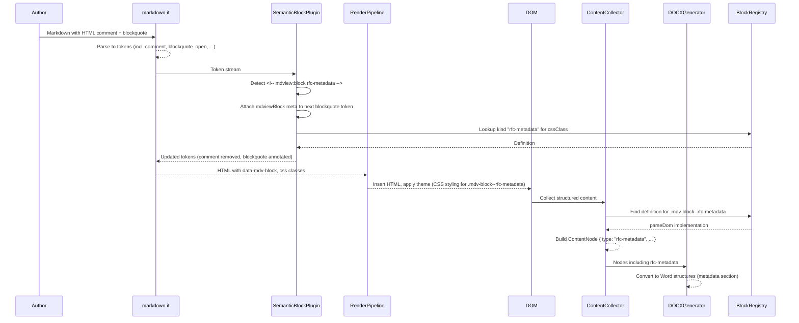

## RFC-20251203-001: MDView Semantic Block DSL via HTML Comments

> Status: Draft  
> Author: James Ainslie  
> Created: 2025-12-03  
> Last Updated: 2025-12-03  
> Supersedes: N/A  
> Superseded By: N/A  

### Abstract

This RFC proposes a semantic block “DSL” for MDView that is expressed entirely through HTML comments applied to standard Markdown blocks. The goal is to enable domain-specific formatting (for example, RFC metadata headers) and richer export semantics, while ensuring that Markdown remains fully standards compliant and renders acceptably in generic viewers. MDView will interpret `<!-- mdview:block KIND ... -->` comments placed immediately before block-level elements, enrich the rendered HTML with semantic classes and data attributes, and expose these semantics to the export pipeline (DOCX, PDF, etc.) via a central registry of block definitions.

### Table of Contents

- [Abstract](#abstract)  
- [Motivation](#motivation)  
  - [Problem Statement](#problem-statement)  
  - [Success Criteria](#success-criteria)  
- [Proposal](#proposal)  
  - [Goals](#goals)  
  - [Non-Goals](#non-goals)  
- [Design](#design)  
  - [Architecture](#architecture)  
  - [Data Flow](#data-flow)  
  - [Configuration](#configuration)  
  - [API/Interface](#apiinterface)  
- [Implementation](#implementation)  
  - [Phase 1: RFC Metadata Block](#phase-1-rfc-metadata-block)  
  - [Phase 2: Generalised Semantic Blocks](#phase-2-generalised-semantic-blocks)  
  - [Phase 3: Tooling and Documentation](#phase-3-tooling-and-documentation)  
- [Testing Strategy](#testing-strategy)  
  - [Unit Tests](#unit-tests)  
  - [Integration Tests](#integration-tests)  
  - [Performance Tests](#performance-tests)  
- [Operational Considerations](#operational-considerations)  
- [Security Considerations](#security-considerations)  
- [Migration Path](#migration-path)  
  - [For Existing Users](#for-existing-users)  
  - [Backward Compatibility](#backward-compatibility)  
- [Alternatives Considered](#alternatives-considered)  
  - [Alternative 1: Heuristic Detection Without Comments](#alternative-1-heuristic-detection-without-comments)  
  - [Alternative 2: Markdown Extensions via Attribute Syntax](#alternative-2-markdown-extensions-via-attribute-syntax)  
  - [Alternative 3: Front-Matter Based Semantics Only](#alternative-3-front-matter-based-semantics-only)  
- [Open Questions](#open-questions)  
- [References](#references)  

### Motivation

#### Problem Statement

MDView currently focuses on high-quality Markdown rendering and export, with support for features such as syntax highlighting, Mermaid diagrams, and DOCX export. However, many real-world documents (RFCs, decision records, changelogs, test plans) rely on structured, domain-specific conventions that are only loosely expressed in pure Markdown. For example, an RFC header like:

> Status: Draft  
> Author: James Ainslie  
> Created: 2025-12-03  
> Last Updated: 2025-12-03  
> Supersedes: N/A  
> Superseded By: N/A  

is semantically a metadata block, but MDView (and generic renderers) treat it as a normal blockquote.

The lack of first-class semantics has several consequences:

1. **Unstructured Rendering**: Important metadata such as status, dates and relationships (“Supersedes”) cannot be distinguished visually from normal prose in a principled way.
2. **Weak Export Semantics**: The DOCX and future PDF exporters see only blockquotes and paragraphs, preventing them from rendering document-type-specific headers or driving workflows (for example, building an index of RFCs by status).
3. **No Central Management of DSL Constructs**: Any document-type conventions are informal and scattered across documents, making them hard to evolve, validate, or document.
4. **Risk of Non-Standard Markdown**: Naively introducing custom markers (for example `{.mdview-block}` or non-standard fenced blocks) would make Markdown files less portable and more surprising in other viewers.

There is a need for a mechanism that gives MDView access to richer semantics while ensuring that Markdown remains valid, standards-compliant, and readable in non-MDView contexts.

#### Success Criteria

- **Criterion 1**: MDView can recognize and specially render an RFC metadata block tagged with a single HTML comment, without changing the Markdown content of the block itself.
- **Criterion 2**: The semantics of at least one block type (`rfc-metadata`) are exposed end-to-end: parsing, on-screen styling, and DOCX export all treat it as a structured metadata object.
- **Criterion 3**: Markdown files using this DSL render as normal, standards-compliant Markdown in other viewers, with no visible MDView-specific tags or syntax.
- **Criterion 4**: The set of semantic block types and their rules are defined in a single, central registry, so that they can be enumerated, documented, and tested.
- **Criterion 5**: The DSL adds no measurable regression to MDView’s render performance for typical documents (< 100 KB), and acceptable overhead (< 10%) for large documents.

### Proposal

#### Goals

- **Goal 1**: Introduce a minimal, comment-driven semantic block DSL for MDView based on the pattern `<!-- mdview:block KIND [key=value ...] -->`, applied to the next block-level element.
- **Goal 2**: Implement `rfc-metadata` as the first semantic block type, providing visually distinct styling and structured export semantics for RFC headers.
- **Goal 3**: Create a central semantic block registry where each block type is defined with its kind, CSS class, DOM parsing logic, and export mapping.
- **Goal 4**: Integrate semantic blocks into the existing MDView pipeline (markdown-it, render pipeline, content collector, DOCX generator) without breaking current behaviour for documents that do not use the DSL.
- **Goal 5**: Provide clear documentation so authors understand how to opt into semantics using comments, while remaining compatible with generic Markdown tooling.

#### Non-Goals

- **Non-goal 1**: Introducing visible non-standard Markdown syntax (for example `{.class}` or custom fenced block languages) as part of the DSL.
- **Non-goal 2**: Implementing a full schema language or user-configurable DSL that is defined purely in external configuration files; the initial scope is static, code-defined block types.
- **Non-goal 3**: Automatic or heuristic inference of block kinds without an explicit HTML comment; classification is comment-driven only in this RFC.
- **Non-goal 4**: Changing the core markdown-it parsing rules or Markdown flavour used by MDView.
- **Non-goal 5**: Implementing semantic awareness for inline constructs (for example custom inline roles); this RFC focuses on block-level semantics.

### Design

#### Architecture

At a high level, the proposal introduces a semantic block layer that bridges between comment-annotated Markdown and both the rendered DOM and export model.

```mermaid
graph TB
    subgraph Input["Input"]
        MD[Markdown Text]:::node
    end

    subgraph Core["MDView Core"]
        MI[markdown-it<br/>+ Plugins]:::node
        SP[Semantic Block Plugin<br/>(HTML comments)]:::node
        RP[RenderPipeline]:::node
        CC[ContentCollector]:::node
        DG[DOCXGenerator]:::node
    end

    subgraph Registry["Semantic Block Registry"]
        SBR[Block Definitions<br/>(kind, cssClass,<br/>parseDom, toContentNode)]:::node
    end

    subgraph Output["Output"]
        DOM[Styled DOM]:::node
        DOCX[DOCX Export]:::node
    end

    MD --> MI
    MI --> SP
    SP --> RP
    RP --> DOM
    DOM --> CC
    SBR --> SP
    SBR --> CC
    CC --> DG
    DG --> DOCX

    classDef node fill:#7b68ee,stroke:#483d8b,color:#ffffff;
```

**Component responsibilities:**

- **Semantic Block Plugin**:
  - Parses `<!-- mdview:block KIND ... -->` comments in the markdown-it token stream.
  - Attaches `mdviewBlock` metadata and corresponding CSS classes / data attributes to the next block-level token.
  - Removes or null-renders the comment tokens so they do not appear in MDView’s HTML output.

- **Semantic Block Registry**:
  - Defines all supported block kinds, their CSS class names, how to parse their DOM into structured fields, and how to convert them into `ContentNode`s for export.

- **RenderPipeline**:
  - Applies global transformations and theming; semantic blocks are styled via CSS classes added by the plugin.

- **ContentCollector**:
  - Recognises semantic blocks in the DOM by their classes or data attributes.
  - Delegates to registry definitions to parse each semantic block into a specialised `ContentNode` type (for example `type: 'rfc-metadata'`).

- **DOCXGenerator**:
  - Adds handling for new `ContentNode` types so semantic blocks can be rendered as appropriate Word structures (for example, a two-column metadata table).

#### Data Flow

The following sequence diagram illustrates how an RFC metadata block flows through the system.



In a generic Markdown renderer that is unaware of MDView:

- The comment `<!-- mdview:block rfc-metadata -->` is ignored or preserved as an invisible comment.
- The blockquote renders as plain quoted text.
- There are no MDView-specific classes or attributes.

#### Configuration

The DSL itself is embodied as code in the semantic block registry, but it should be possible to expose a simple configuration for enabling or disabling specific block kinds and controlling their export behaviour.

A minimal configuration shape (stored in MDView preferences) could be:

```yaml
mdview:
  semanticBlocks:
    enabledKinds:
      - rfc-metadata
    export:
      rfc-metadata:
        docx:
          renderAs: "table"   # or "paragraphs"
          showSupersedes: true
          showSupersededBy: true
```

- **`semanticBlocks.enabledKinds`**: list of semantic block kinds that MDView should interpret. Unknown comments are ignored.
- **`semanticBlocks.export.<kind>.docx.renderAs`**: per-kind strategy for DOCX rendering (for example table vs paragraphs).
- **`semanticBlocks.export.<kind>.docx.show*`**: simple booleans controlling which fields appear in export; MDView still parses all fields.

These options are optional; absence of configuration defaults to all built-in blocks being enabled with conservative export behaviour.

#### API/Interface

At the internal TypeScript level, the key abstractions are:

- **Semantic block definition**:

```typescript
export type SemanticBlockKind = 'rfc-metadata' /* | 'callout' | ... */;

export interface SemanticBlockDefinition {
  kind: SemanticBlockKind;
  cssClass: string; // e.g. "mdv-block--rfc-metadata"
  // Parse attributes from the HTML comment (key=value pairs)
  parseParams(params: Record<string, string>): Record<string, string>;
  // Parse DOM into structured fields
  parseDom(element: HTMLElement, params: Record<string, string>): {
    fields: Record<string, string>;
  } | null;
  // Optional export mapping
  toContentNode?(
    parsed: { fields: Record<string, string>; params: Record<string, string> }
  ): import('../types').ContentNode;
}
```

- **Semantic block registry interface**:

```typescript
export interface SemanticBlockRegistry {
  get(kind: SemanticBlockKind): SemanticBlockDefinition | undefined;
  all(): SemanticBlockDefinition[];
}
```

- **HTML comment grammar (informal)**:
  - Prefix: `mdview:block`
  - Kind: `[a-zA-Z0-9_-]+`
  - Parameters: zero or more `name=value` pairs, where:
    - `name` is `[a-zA-Z0-9_-]+`
    - `value` is either bare (no spaces) or quoted with double quotes

Example:

```markdown
<!-- mdview:block rfc-metadata status=Draft created="2025-12-03" -->
```

The markdown-it plugin will expose no public API; it operates entirely as an internal extension of the existing `MarkdownConverter` configuration.

### Implementation

#### Phase 1: RFC Metadata Block

**Scope:**

- Introduce the notion of semantic blocks using HTML comments for a single block kind: `rfc-metadata`.
- Implement the markdown-it plugin that:
  - Recognises and parses `<!-- mdview:block rfc-metadata ... -->` comments.
  - Attaches `mdviewBlock` metadata and CSS classes / data attributes to the next block-level token.
  - Removes the comment token from MDView’s HTML.
- Define a `SemanticBlockDefinition` for `rfc-metadata` that:
  - Assumes the annotated element is a blockquote.
  - Parses its child paragraphs into `Key: Value` pairs with a known key set (`Status`, `Author`, `Created`, `Last Updated`, `Supersedes`, `Superseded By`).
  - Returns a structured field map.
- Add CSS to `content.css` for `.mdv-block--rfc-metadata` and sub-elements (keys and values) to make the metadata visually distinct while respecting theme variables.
- Extend `ContentCollector` to:
  - Detect `.mdv-block--rfc-metadata` in `processBlockquote`.
  - Create a dedicated `ContentNode` with `type: 'rfc-metadata'` and appropriate `attributes`.
- Extend `DOCXGenerator` to:
  - Handle `rfc-metadata` nodes by rendering a small two-column table or grouped paragraphs at the top of the document.

**Deliverables:**

- Comment grammar defined and implemented for `rfc-metadata`.
- End-to-end support for RFC headers: Markdown → styled MDView render → DOCX export.

#### Phase 2: Generalised Semantic Blocks

**Scope:**

- Factor the `rfc-metadata`-specific code into a general semantic block registry and interfaces.
- Add support for at least one additional block type to validate generality (for example a `decision-log` or `callout` block).
- Allow per-kind enable/disable flags via MDView preferences.
- Ensure that all paths for documents without semantic blocks are unaffected.

**Deliverables:**

- Registry module and interfaces in place.
- At least two block kinds implemented and tested.
- Preferences wiring for enabling/disabling block kinds.

#### Phase 3: Tooling and Documentation

**Scope:**

- Add documentation describing:
  - The HTML comment syntax.
  - Available block kinds and their semantics.
  - Examples for RFCs and other document types.
- Optionally, add editor affordances:
  - Snippet examples in project documentation.
  - (Future) quick insert templates via MDView UI (if appropriate).
- Add tests and CI coverage for semantic block behaviours.

**Deliverables:**

- Markdown documentation in the repository (for example `RFC-DSL-SEMANTIC-BLOCKS.md` or an addition to existing docs).
- Automated tests integrated into existing test suites.

### Testing Strategy

#### Unit Tests

- **SemanticBlockPlugin**:
  - Parsing of HTML comments into `(kind, params)` structures.
  - Correct association of comments to the next block-level token.
  - Correct attachment of `mdviewBlock` metadata and CSS classes.
  - Removal of comment tokens from rendered HTML.
- **rfc-metadata Definition**:
  - DOM parsing from blockquote to expected field maps, including handling of missing or extra keys.
  - Robustness to minor formatting variations (for example trailing spaces).
- **ContentCollector Extensions**:
  - Conversion of `.mdv-block--rfc-metadata` elements to `ContentNode` objects with correct attributes.
- **DOCXGenerator**:
  - Conversion of `rfc-metadata` nodes to expected Word structures (for example table cell texts).

#### Integration Tests

- **Scenario 1**: Document with RFC header and body.
  - Given a Markdown file with an RFC metadata block comment and blockquote, verify:
    - MDView renders a visually distinct metadata block.
    - Generic Markdown rendering (without MDView) still shows a normal blockquote and invisible comment.
- **Scenario 2**: Document without comments.
  - Verify behaviour is unchanged from current MDView.
- **Scenario 3**: Multiple semantic blocks.
  - In a document containing multiple `mdview:block` comments of different kinds, verify correct association with the following blocks and registry lookups.
- **Scenario 4**: DOCX export of RFC.
  - Export a document with an RFC metadata block and assert that the generated DOCX has the metadata rendered in the expected region/structure.

#### Performance Tests

- **Render Time**:
  - Measure render time for:
    - A typical RFC-sized document (~5–20 KB).
    - A large technical document (~100 KB) with and without semantic block comments.
  - Ensure the plugin adds negligible overhead relative to total render time.
- **Memory Footprint**:
  - Validate that the semantic block registry and plugin do not retain references to large DOM fragments beyond the lifetime of a render.

### Operational Considerations

- **Configuration Management**:
  - Semantic block kinds are defined in code and versioned with MDView. There is no runtime registry modification in this RFC.
- **Observability**:
  - Existing logging facilities (for example `debug-logger`) should log:
    - Detection and parsing of semantic blocks.
    - Any parsing failures (for example malformed comments) at a debug or warning level.
- **Failure Modes**:
  - If a comment is malformed or refers to an unknown kind:
    - MDView should ignore the comment and render the following block normally.
    - No visible errors should appear in the rendered document; logs may record the incident.

### Security Considerations

- The DSL is based on HTML comments and does not introduce executable code.
- All existing sanitization (for example DOMPurify in `RenderPipeline`) remains in place; semantic blocks operate on already-sanitized HTML.
- Comments are stripped from MDView’s own HTML output; they are not exposed to the page DOM where they might accidentally interact with other tools.
- No new network calls or external resources are introduced.

### Migration Path

#### For Existing Users

- Existing Markdown documents without `mdview:block` comments are unaffected.
- To adopt the new semantics for RFCs:
  1. Add an HTML comment immediately before the RFC header blockquote, for example:

     ```markdown
     <!-- mdview:block rfc-metadata -->

     > Status: Draft  
     > Author: James Ainslie  
     > ...
     ```

  2. Reopen or reload the document in MDView.
  3. Optionally export to DOCX and verify that the metadata appears in the desired format.

No content changes are required to the blockquote lines themselves.

#### Backward Compatibility

- In viewers that do not understand MDView:
  - The comment remains an invisible HTML comment.
  - The RFC metadata appears as a normal blockquote, as before.
- Disabling semantic block support (for example via configuration or by shipping a build without the plugin) reverts behaviour to purely structural Markdown rendering without altering the underlying `.md` files.
- Because the DSL uses only valid HTML comments, it is unlikely to interfere with other tooling that ignores comments.

### Alternatives Considered

#### Alternative 1: Heuristic Detection Without Comments

**Approach:** Automatically detect RFC metadata blocks based solely on structure and content, for example “first blockquote in document whose lines match `Key: Value` with known keys”.

**Pros:**

- Zero explicit syntax; authors write plain Markdown without any additional markers.
- Works automatically for existing documents that already follow a convention.

**Cons:**

- Heuristics can be brittle: small deviations in formatting or ordering may break detection.
- Difficult to disambiguate overlapping conventions or future block types.
- Hard to reason about and to document; authors have no explicit “switch” to control behaviour.

**Decision:** Rejected for this RFC. The comment-based DSL provides explicit, deterministic semantics and aligns better with the requirement to avoid brittle heuristics.

#### Alternative 2: Markdown Extensions via Attribute Syntax

**Approach:** Use `markdown-it-attrs` syntax in source Markdown, for example:

```markdown
> Status: Draft  
> Author: ...
{.mdv-block .mdv-block--rfc-metadata}
```

**Pros:**

- Compact syntax integrated into Markdown.
- Attributes appear in the rendered HTML of any renderer that respects those extensions.

**Cons:**

- The `{.class}` syntax is not part of the strict CommonMark / GFM spec and may render as literal text or be ignored in other viewers.
- Violates the requirement that MDView’s hooks not appear visibly in standard Markdown viewers.
- Leaks MDView-specific concerns directly into the visible Markdown surface.

**Decision:** Rejected. This RFC preserves strict Markdown compatibility in visible content.

#### Alternative 3: Front-Matter Based Semantics Only

**Approach:** Store all document-level semantics in front-matter (YAML or similar), and avoid block-level semantic annotations.

**Pros:**

- Clean separation of metadata from body; common pattern in static site generators.
- No additional syntax in the body.

**Cons:**

- Does not address in-body domain-specific blocks (for example decision logs, callouts, section-level metadata).
- Requires front-matter adoption and tooling changes that may not align with all existing documents.
- Cannot express multiple semantic blocks within a single document.

**Decision:** Rejected as incomplete for the use cases motivating this RFC. Front-matter may complement, but not replace, block-level semantics.

### Open Questions

1. **Parameterisation Strategy for Future Blocks**  
   - Context: Some future block kinds (for example callouts) may need parameters such as variant (`note`, `warning`) or icons.  
   - Question: Should parameters be strictly enumerated per kind in the registry, or is a looser, free-form parameter map acceptable with validation only at parse time?

2. **Editor-Level UX for Inserting Comments**  
   - Context: Hand-typing HTML comments is error-prone.  
   - Question: Should MDView eventually provide UI assistance (for example insert-snippet buttons) for common block kinds, and if so, where should that live?

3. **Interaction with Other Tools That Use Comments**  
   - Context: Some tools (for example static site generators) may also interpret HTML comments.  
   - Question: Is there a need for a namespacing convention or additional guard (beyond the `mdview:` prefix) to ensure that MDView comments never conflict with other tooling?

### References

- MDView codebase: `MarkdownConverter`, `RenderPipeline`, `ContentCollector`, `DOCXGenerator`.
- [CommonMark Specification](https://spec.commonmark.org/) (for baseline Markdown behaviour).  
- [markdown-it Documentation](https://github.com/markdown-it/markdown-it) (parser and plugin architecture).  
- [DOMPurify Documentation](https://github.com/cure53/DOMPurify) (sanitization in the render pipeline).  
- Existing MDView RFC: `RFC-20251202-001-docx-svg-support.md` (for style and export considerations).


